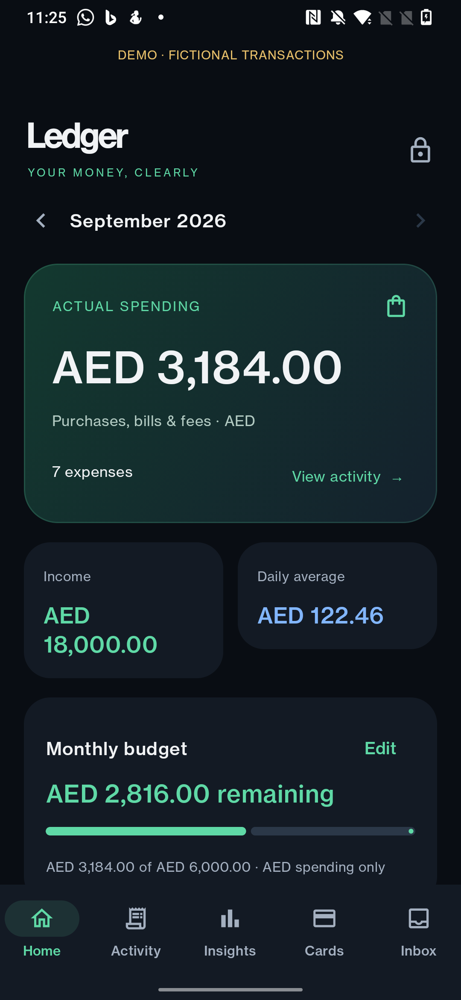
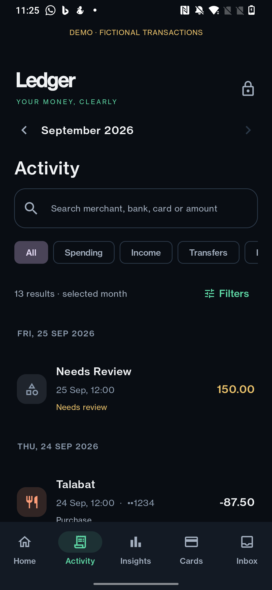
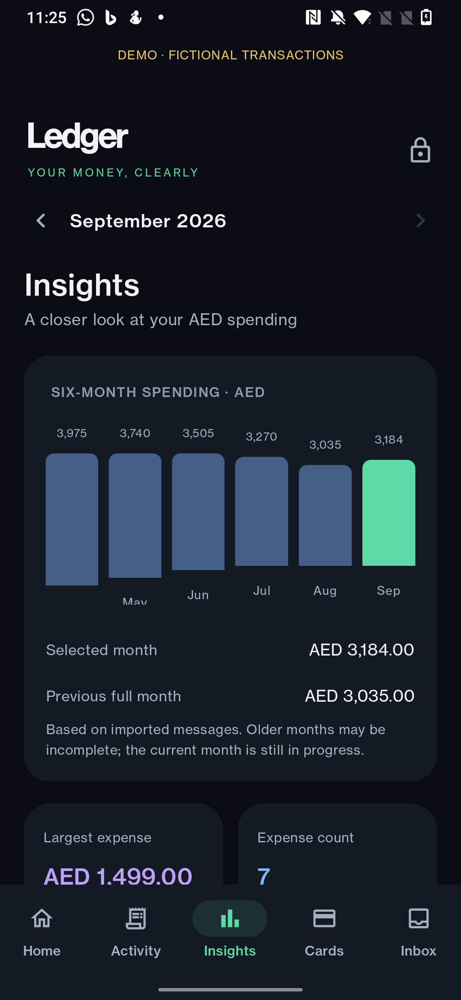
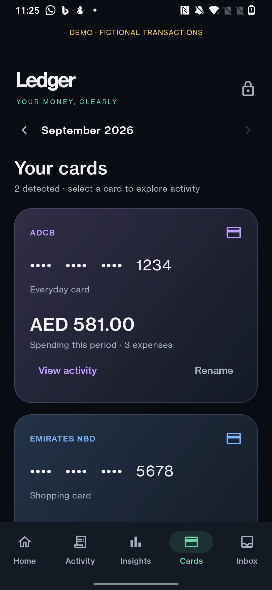

# Ledger

**Your money, clearly.** An offline Android spending tracker built around UAE bank SMS.

[**Download Ledger 1.2.1 APK**](https://github.com/meetdheeran/ledger/releases/download/v1.2.1/Ledger-1.2.1.apk) · [Release notes](https://github.com/meetdheeran/ledger/releases/tag/v1.2.1) · [Report an issue](https://github.com/meetdheeran/ledger/issues)

Android 12+ · Kotlin · Jetpack Compose · AED-focused · No internet permission

## A clearer picture of your spending

Ledger turns bank messages into searchable activity, card views, budgets and spending insights. Purchases, bills and fees count as spending. Salary, transfers, repayments, refunds and cash withdrawals have separate transaction types. Unclear messages stay out of the spending total until reviewed.

## Screenshots

Actual app screens captured on a OnePlus 7 using the separate **Ledger Demo** build. All transactions, amounts and card details below are fictional.

<table>
  <tr>
    <th>Dashboard & budget</th>
    <th>Searchable activity</th>
  </tr>
  <tr>
    <td></td>
    <td></td>
  </tr>
  <tr>
    <th>Spending insights</th>
    <th>Your cards</th>
  </tr>
  <tr>
    <td></td>
    <td></td>
  </tr>
</table>

## Install

1. [Download the APK](https://github.com/meetdheeran/ledger/releases/download/v1.2.1/Ledger-1.2.1.apk) on an Android 12 or newer phone.
2. Open it and allow installation from your browser or file manager if Android asks.
3. Open Ledger, set a password and grant SMS access to import your bank messages.

**Updating an existing installation?** Install over the old app to retain your history. Do not uninstall first. Android requires the same signing key for an in-place update.

The release includes the regular app, **not the demo**, plus a SHA-256 checksum. It is a development-signed build for direct installation, not a Play Store release. APKs live in [GitHub Releases](https://github.com/meetdheeran/ledger/releases), keeping the source repository small.

## Features

| View | What you can do |
| --- | --- |
| **Home** | See actual spending, income, other money movements and monthly budget progress. |
| **Activity** | Search by merchant, bank, card or amount. Filter by type, category, currency, card and month, or browse all saved history. |
| **Insights** | Explore six-month trends, category shares, top merchants, daily spending and your largest expense. |
| **Cards** | View spending for each detected card, rename it and open its activity. Cards are identified by bank plus card suffix. |
| **Inbox** | Review unreadable bank messages or register a missing bank's exact SMS sender. |

- Reads the last **30 days** on first import and rescan; older saved history remains available.
- Detects cards from SMS and picks up new bank messages as they arrive.
- Lets you correct a transaction's type; corrections survive rescans.
- Remembers merchant category corrections for past and future transactions.
- Keeps separate budgets for each month.
- Reclassifies saved history when upgrading, without resetting the password or card names.

## How totals work

Only **purchases, bill payments and bank fees in AED** contribute to spending. Refunds are shown separately rather than deducted from an unrelated month's purchases. Card repayments do not count as a second expense.

Foreign-currency alerts keep their original currency and are excluded from AED totals. Ledger does not assume an exchange rate. OTPs, declined payments and pending/future payment notices do not count. Messages with multiple transaction amounts or uncertain purposes require review.

Charts reflect imported SMS, not a complete bank statement. Older months may contain partial history. Duplicate detection recognises the same source message; it does not reconcile different alerts describing the same purchase.

## Privacy and storage

- **No bank login, server or internet permission.** Processing happens on the phone.
- Only messages tied to a recognised or user-added bank sender are imported.
- A password gates access to the app; it locks when you leave.
- Cloud backup and device-to-device transfer are disabled.
- **The database is not encrypted.** The password protects the app screen, not the database file against developer/root access.

## UAE bank coverage

The sender rules include **49 bank and banking-brand entries**, expanded using retail-bank names in the [CBUAE August 2026 register](https://centralbank.ae/media/hw0lreyi/cb-register-august-2026.pdf). These aliases are matching rules, not a bank-certified directory of SMS IDs or a guarantee of authenticity.

The same classification rules apply across recognised banks and card products. For a missing sender, use **Inbox → Add a missing bank sender**. Bank names and merchant categories live in [`rules.json`](app/src/main/assets/rules.json).

Automated purpose detection currently covers English message patterns. Arabic digits and dirham labels are normalised, but unsupported wording may need review. Universal accuracy across every bank template is not claimed. Tests use synthetic fixtures, not private inbox data.

## Build and test

Requires **JDK 17** and **Android SDK 34**. Set `sdk.dir` in a local, untracked `local.properties`. Keep the pinned Kotlin/Android dependency versions together.

```powershell
.\gradlew.bat testDebugUnitTest assembleDebug lintDebug
python tools/check_storage.py
adb install -r app/build/outputs/apk/debug/app-debug.apk
```

Validation includes **43 automated tests** and a SQLite check of the v1 → v2 migration, retained data, spending aggregates, currency exclusions and duplicate constraints. The APK builds successfully; lint reports no errors, with existing dependency/resource warnings.

### Reproduce the screenshots

```powershell
.\gradlew.bat assembleDemo
adb install -r app/build/outputs/apk/demo/app-demo.apk
adb shell am start -n com.meetdheeran.ledger.demo/com.meetdheeran.ledger.demo.DemoActivity
```

The demo uses a separate application ID and data sandbox, includes only invented transactions, and has **no SMS permissions or SMS receiver**. Its startup activity exists only in the demo source set. The regular APK retains its password and permission flow.

## What's new in 1.2.1

- Added the public APK download and screenshot gallery.
- Added a separate, reproducible demo build for safe screenshots.
- Fixed clipped month labels and inconsistent bar alignment in the six-month chart.
